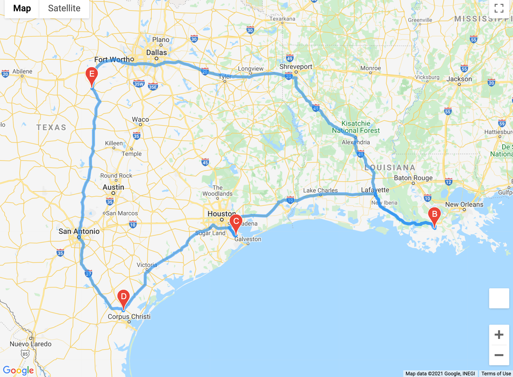
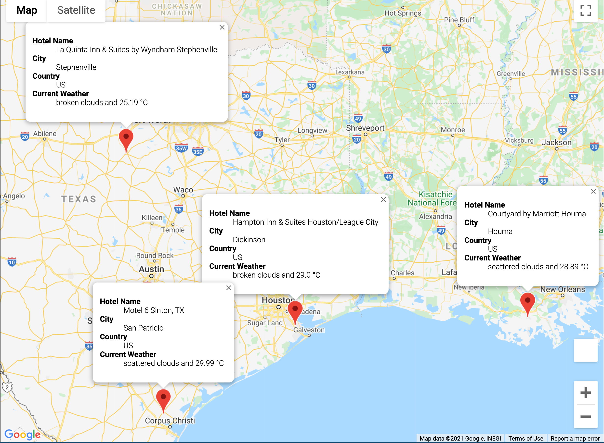

# WeatherPy

## Overview

This project demonstrates using how to use APIS to gather information. There are three parts to this project, each separated by its own folder.

## Resources

- Software: Python 3.7.6, Visual Studio Code 1.56.0, gmaps-0.9.0-, 
- APIs: OpenWeather API, Google Directions API, Google Places API

## Weather Database (\Weather_Database)

The Weather Database generates 2000 random latitudes and longitudes pairs. CitiPy is then used to find the closest city. A request for each city is then sent to the Open Weather API (https://openweather.org/api) to gather weather information on that city.

Outputs - \Weather_Database\WeatherPy_Database.csv

## Vacation Search (\Vacation_Search)

The user is queried on their preferred temperature range (in celsius). Using the user input, a new dataframe containing cities within that range is generated.

The Google Places API is then queried for a hotel nearby and markers are placed on a map. (see below)

Outputs - \Vacation_Search\WeatherPy_vacation.csvs

## Vacation Itinerary (\Vacation_Itinerary)

Using the the data above, 4 cities were chosen to create a travel itinerary route:

- Stephenville
- Houma
- Dickinson
- San Patricio

The code in this section will return 2 figures:

Travel Route:

Markers:

